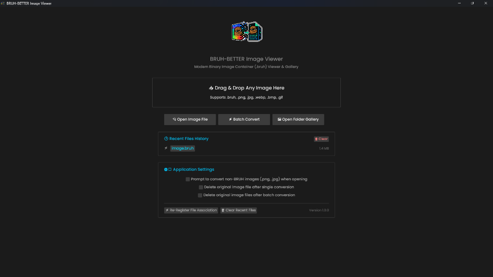
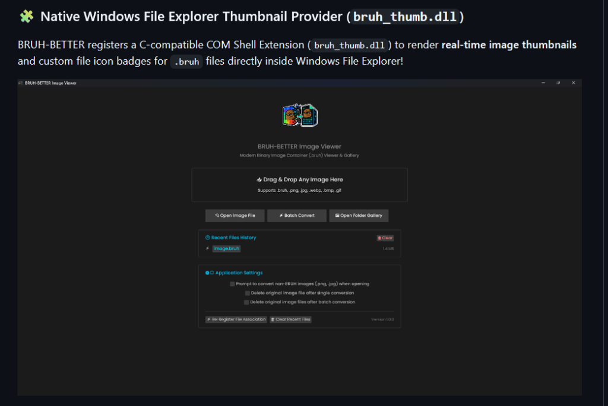
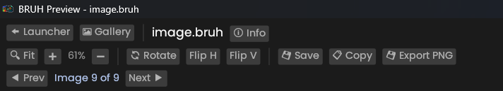
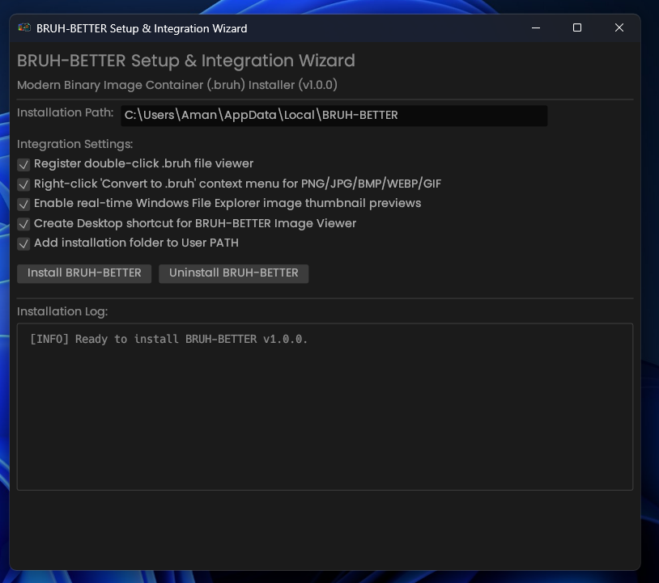

<p align="center">
  
</p>

<h1 align="center">BRUH-BETTER</h1>

<p align="center">
  <b>Modern Binary Image Container (.bruh) Viewer, Converter & Windows Integration Toolkit</b>
</p>

<p align="center">
  <a href="https://github.com/amandeepintl/bruh-BETTER/releases/tag/v1.0.0">
    
  </a>
  <a href="LICENSE">
    
  </a>
  <a href="https://github.com/amandeepintl/bruh-BETTER/actions">
    
  </a>
  
</p>

---

## ⚡ Overview

**BRUH-BETTER** is a high-performance binary image container toolkit written in Rust. It features a custom Zlib-compressed binary file format (`.bruh`), an interactive GPU-accelerated image viewer, a 100% responsive thumbnail gallery grid, a 1-click batch image converter, persistent application settings, and native Windows Explorer shell extension integration.

<p align="center">
  
  <br>
  <i>Native Windows File Explorer preview showing real-time .bruh image thumbnails and file icon badges!</i>
</p>

---
## 📸 Interface Showcase
---

### 🏠 Main Launcher & Application Settings
Drag & drop file input, 3 quick action buttons (`Open Image File`, `Batch Convert`, `Open Folder Gallery`), 10-item scrollable Recent Files History, and persistent Application Settings.



---

### 🖼️ Interactive Image Viewer
Fullscreen viewport displaying `.bruh`, `.png`, `.jpg`, `.webp`, `.bmp`, and `.gif` images with real-time zoom, drag/pan, and smooth navigation.


---

### 🛠️ Toolbar Header Controls
Complete toolbar featuring `Fit`, `Zoom (+/-)`, `Rotate 90° CW`, `Flip H`, `Flip V`, `Save`, `Copy`, `Export PNG`, and `Prev` / `Next` folder navigation.



---

### ⚙️ Setup & Integration Wizard (`bruh-setup.exe`)
Automated installer setup wizard to configure Windows file associations, context menu options, desktop shortcuts, PATH environment variables, and shell thumbnail extensions.



---

### 🧩 Native Windows File Explorer Thumbnail Provider (`bruh_thumb.dll`)
BRUH-BETTER registers a C-compatible COM Shell Extension (`bruh_thumb.dll`) to render **real-time image thumbnails** and custom file icon badges for `.bruh` files directly inside Windows File Explorer!

<p align="center">
  
</p>

---

## 🚀 Complete Feature List

- **⚡ Zlib Binary Container Codec (`.bruh`)**: High-ratio compression with 14-byte `BTTR` binary magic header.
- **🖼️ Interactive GPU Viewer**: Dynamic zoom, pan, 90° rotation, `Flip H`, `Flip V`, keyboard arrow navigation.
- **🔄 Save Options Workflow**: Interactive `💾 Save Image Changes` modal (Overwrite Original vs Save Copy vs Export PNG).
- **📂 100% Responsive Gallery Grid**: Dynamic reflowing thumbnail grid layout (`cols = available_width / card_w`) with lazy caching.
- **⚡ 1-Click Batch Image Converter**: Mass folder converter accessible from Launcher or Gallery header.
- **🕒 Persistent Recent Files History**: Top 10 recent files history stored in `%LOCALAPPDATA%\BRUH-BETTER\recent_files.txt`.
- **⚙️ Launcher Application Settings**: Persistent popup warning preferences (`suppress_modal.txt`), auto-delete preferences, and file association maintenance.
- **💻 Windows Registry Integration**: Default `.bruh` file association and Explorer right-click context menu (*"Open with BRUH-BETTER"*).
- **🧩 Windows File Explorer Thumbnail Provider DLL (`bruh_thumb.dll`)**: Real-time thumbnail previews in Windows File Explorer.
- **🛠️ GUI Installer Wizard (`bruh-setup.exe`)**: Desktop/Start Menu shortcut & PATH setup wizard.

---

## 📦 Downloads & Installation

### Option A: Download Pre-Built Binaries
Download the latest binaries directly from the [Official V1.0.0 Release](https://github.com/amandeepintl/bruh-BETTER/releases/tag/v1.0.0):
- **`bruh-setup.exe`**: GUI Setup Installer Wizard
- **`bruh.exe`**: Portable Standalone Application
- **`bruh_thumb.dll`**: Windows Shell Extension DLL

### Option B: Build From Source

```bash
# Clone repository
git clone https://github.com/amandeepintl/bruh-BETTER.git
cd bruh-BETTER

# Build release binaries
cargo build --release

# Run GUI application
cargo run --release
```

---

## 💻 CLI Usage

```bash
# Compile a standard image to .bruh format
bruh compile input.png output.bruh

# Decode a .bruh file back to PNG
bruh decode input.bruh output.png

# Register Windows file associations & right-click context menu
bruh register
```

---

## 🧪 Automated Testing

Run the Rust test suite:

```bash
cargo test
```

---

## 📄 License

Distributed under the MIT License. See [`LICENSE`](LICENSE) for more information.
