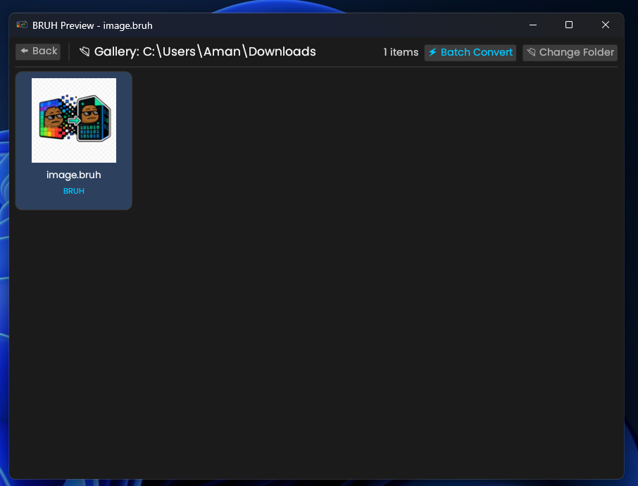
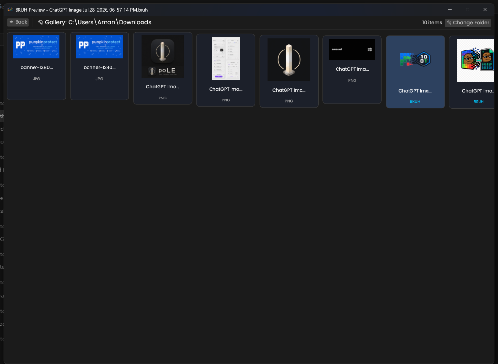

<p align="center">
  
</p>

<h1 align="center">BRUH-BETTER</h1>

<p align="center">
  <b>High-Speed Binary Image Container Format (.bruh) & Desktop Toolkit</b>
</p>

<p align="center">
  <a href="https://github.com/amandeepintl/bruh-BETTER/releases/tag/v1.0.0">
    
  </a>
  <a href="LICENSE">
    
  </a>
  <a href="https://github.com/amandeepintl/bruh-BETTER/actions">
    
  </a>
  
</p>

---

## ⚡ Overview

**BRUH-BETTER** is a modern, high-speed binary image container ecosystem built in Rust. It combines a custom Zlib-compressed binary file format (`.bruh`), a native GPU-accelerated desktop viewer, a 100% responsive thumbnail gallery grid, 1-click batch image conversion tools, and full Windows Explorer shell extensions.

---

## 📸 Screenshots & Highlights

### 🖼️ Interactive Image Viewer & Save Workflow
> Zoom, pan, rotate 90° CW, flip horizontally/vertically, and export to PNG or overwrite files with a non-destructive interactive save workflow.

<p align="center">
  
</p>

---

### 📂 100% Responsive Thumbnail Gallery Grid
> Reflowing dynamic thumbnail grid layout that scales seamlessly based on window width with lazy image caching and instant folder navigation.

<p align="center">
  
</p>

---

### ⚡ 1-Click Folder Batch Converter
> Convert entire folders of standard images (`.png`, `.jpg`, `.webp`) to `.bruh` format in parallel with optional source file auto-deletion.

<p align="center">
  
</p>

---

## ✨ Features

- **⚡ Binary Container Codec (`.bruh`)**: Custom 14-byte `BTTR` header with high-ratio Zlib payload compression.
- **🖼️ Interactive Image Viewer**: Dynamic zoom (`Fit`, `Zoom In`, `Zoom Out`), pan, 90° rotation, `Flip H`, `Flip V`.
- **💾 Flexible Save Options**: Non-destructive `Save Copy` dialogs and direct `Overwrite Original` mode.
- **📂 Responsive Gallery Grid**: Dynamic grid wrapping (`cols = available_width / card_width`) with lazy caching.
- **⚡ Folder Batch Converter**: 1-click folder batch converter accessible from Launcher or Gallery header.
- **🕒 Recent Files History**: Persistent 10 recent files history stored in `%LOCALAPPDATA%\BRUH-BETTER\recent_files.txt`.
- **⚙️ Launcher Application Settings**: Disk-persisted modal suppression (`suppress_modal.txt`), auto-delete preferences, and file association maintenance.
- **💻 Windows OS & Explorer Shell**: Context menu integration (*"Open with BRUH-BETTER"*), default `.bruh` file associations, and native thumbnail provider DLL (`bruh_thumb.dll`).

---

## 📦 Installation & Quick Start

### 1. Download Pre-Built Executables
Download the latest binaries directly from the [Official V1.0.0 Release](https://github.com/amandeepintl/bruh-BETTER/releases/tag/v1.0.0):
- **`bruh-setup.exe`**: GUI Setup Installer Wizard (registers file associations & creates Desktop/Start Menu shortcuts).
- **`bruh.exe`**: Portable standalone application.
- **`bruh_thumb.dll`**: Windows File Explorer Shell Thumbnail Extension DLL.

### 2. Build From Source

```bash
# Clone the repository
git clone https://github.com/amandeepintl/bruh-BETTER.git
cd bruh-BETTER

# Build release binaries
cargo build --release

# Run GUI application
cargo run --release
```

---

## 💻 CLI Usage

```bash
# Compile a standard image (.png, .jpg) to .bruh format
bruh compile input.png output.bruh

# Decode a .bruh file back to PNG
bruh decode input.bruh output.png

# Register Windows file associations & right-click context menu
bruh register
```

---

## 🧪 Testing

Run the automated Rust test suite:

```bash
cargo test
```

---

## 📄 License

Distributed under the MIT License. See [`LICENSE`](LICENSE) for more information.
